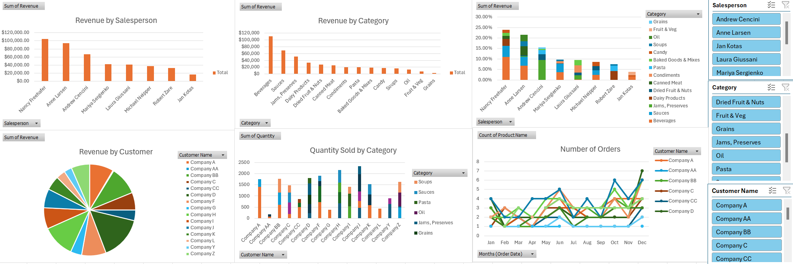
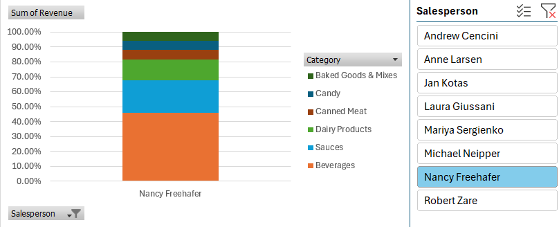
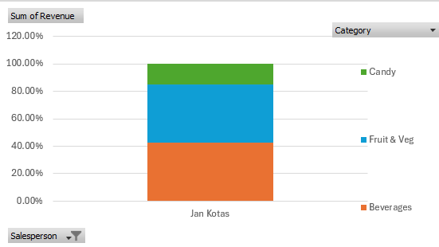
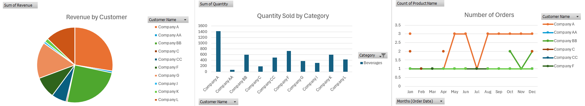
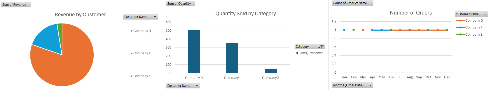
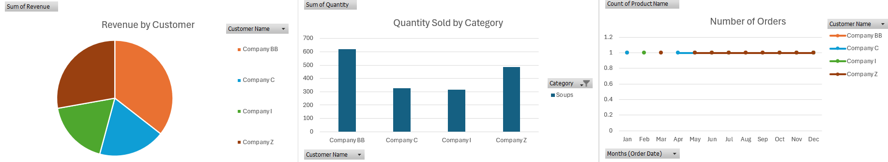
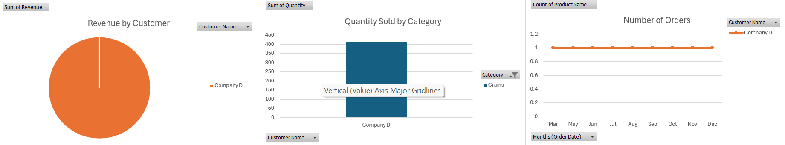

### The following dashboard was created from a fictional b2b sales company that sold food items in various categories to other companies in 2021.

First, we see a ranked list of the company's salespeople based on the sum of revenue they generated in 2021. Nancy Freehafer brings in the most revenue with over $100,000 and Jan Kotas brings in the least with less than $20,000. It would be appropriate to look into the performances of the underperformes salespeople (those bringing in less than $40,000-$50,000) and develop a personalized plan to improve their results including constructive feedback, more training, monitoring their progress, and more.

Looking at the next graph, we see that Beverages is the highest revenue-generating category with over $100,000 in sales. On the opposite end, categories like Candy, Soups, Oil, Fruits & Veg, and Grains each sell less than $20,000, with the latter two categories selling less than $10,000 combined. As a result, consider adjusting the inventory to hold more of the better performing categories and less of the worse performing categories to reduce the cost of keeping inventory that does not sell. Or, to combat the low sales consider analyzing the current customers' response to such products and develop a marketing plan to garner more interest in the poorly selling categories.

The next graph displays the salespeople and a breakdown of the products they sell based on the percentage of revenue the sales bring in. We can isolate each salesperson by using the Excel Salesperson slicer on the right. For example, if we select Nancy Freehafer . . . 

. . . we see that almost 50% of Freehafer's generated revenue is derived from Beverage sales, with the other 50% being comprised of sales in the Sauces, Dairy Products, Canned Meats, Candy, and Baked Goods & Mixes categories. 

If we take a look at Jan Kotas' sales breakdown, we see that a little over 50% of the sales comes from the Candy and Fruits & Veg categories, which, as previously seen, bring in a small fraction of revenue compared to categories like Beverages.

The remaining graphs show the company's customer base, quantity of products sold, and the number of transaction per month. We see that the sales company has a diverse mix of customers. However, if we use the Category slicer to the right, we can see what companies are responsible for buying products within each category. 

For example, categories like Beverages perform better due to a diverse set of customers that buy a lot and have multiple transactions throughout the month and year at an average price of $22. 

Jams, Preserves also generates high revenue, despite having a lower quantity sold and lower number of transactions compared to Beverages due to a higher average unit price of $51.

Categories like Soups sell in a similar manner to Jams, Preserves in terms of quantity and number of transactions per month, however, they do not generate much revenue due to a low unit price of $10.

And finally, Grains (the lowest revenue-generating category) is the opposite of Beverages because it only has one customer that also buys a small quantity with a low average unit price of $7.

Based on these insights, it is evident that revenue performance may be influenced by a combination of sales performance by certain individuals, the buying habits of the current customer base, and unit price. Further analysis may narrow down which of the three factors may result in improvement in sales and revenues. In the case of grains, branching out to target companies that sell such items and would be more likely to consistently buy such products may be the solution to increasing revenues

