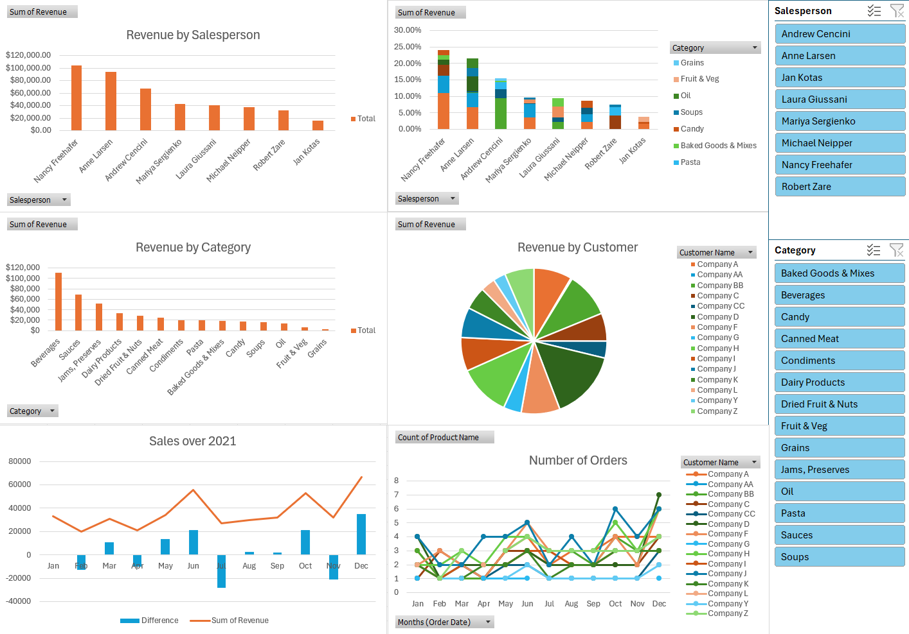

### The following dashboard was created from a fictional sales company during 2021.

First, we see a ranked list of salespeople by sum of reveny they brought in. Nancy Freehafer brings in the most revenue with over $100,000 and Jan Kotas brings in the least with less than $20,000. It would be appropriate to look into the performances of the bottom half and develop a personalized plan to improve their results whether it be more training or other methods. It is evident that Beverages bring in the most revenue followed by sauces and jams, preserves.On the opposite end, Fruit and Veg and Grains do not sell as well and bring in less than $10,000 in revenue combined. As a result, consider adjusting the inventory to hold more of the better performing items and less of the worse performing items to reduce the cost of keeping inventory taht does not sell. Or, consider developing a sale or marketing plan to garner more interest in the lower perofmring cateogires. Next, we see the percentage of revenue that each salesperson is responsible for as well as th epercentage of each category they bring in revenue from. Next, we see the total revnue by each month in 2021. It seems that revenue in 2021 was at its lowest in February, and hit a peak in December. The largest increase occured from November to December, and the largest decrease occured from June to July. 

