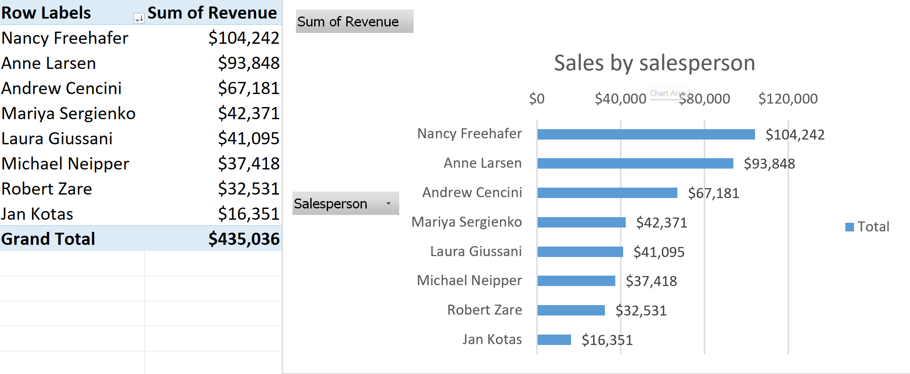
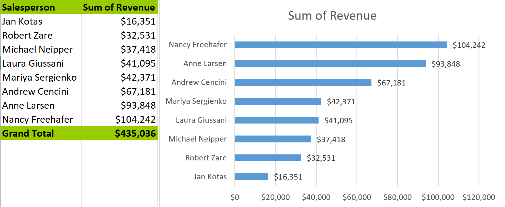
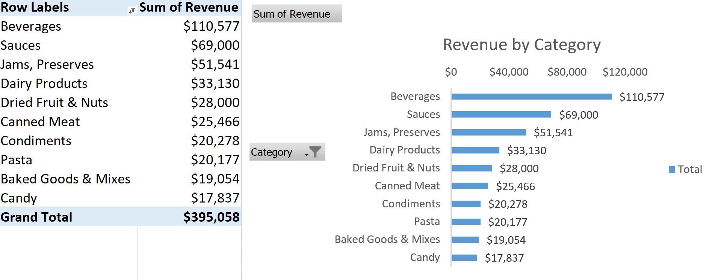
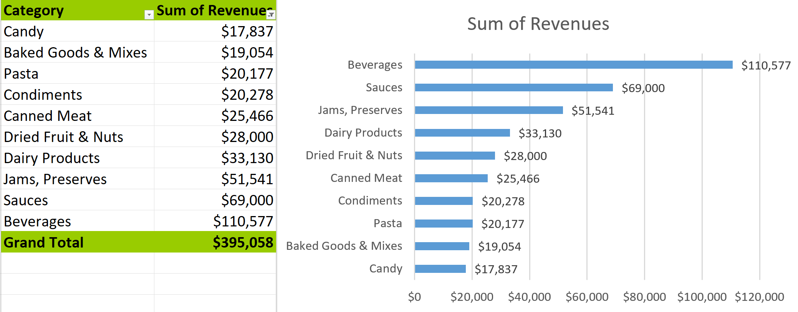
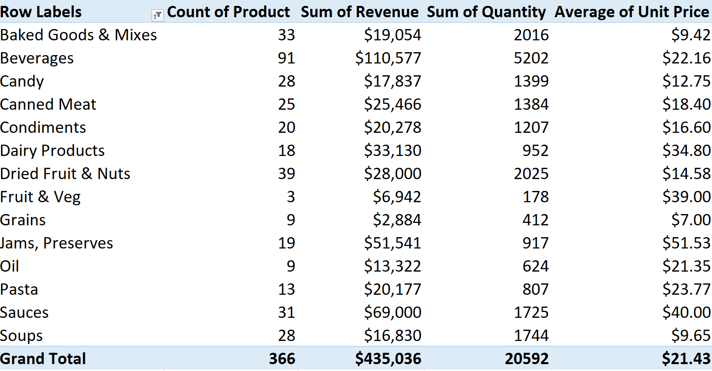
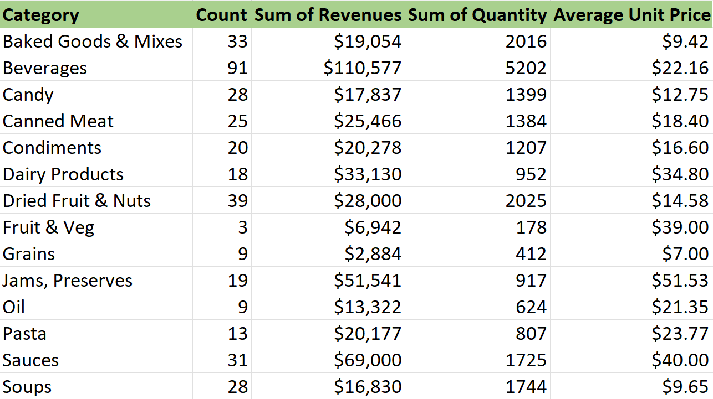
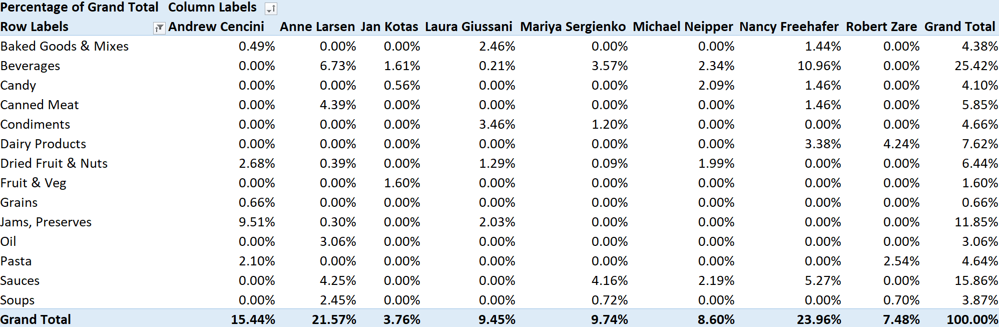
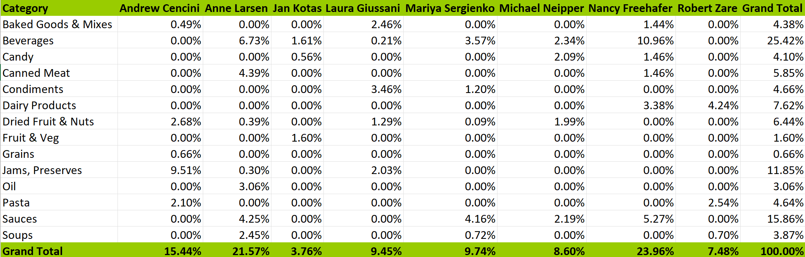

## Excel

To teach us how how to use Excel PivotTables, PivotCharts, and a few functions, the professor provided the class with a fictional company's sales spreadsheet that includes the following attributes:
- Order ID
- Order Date
- Customer ID
- Customer Name
- Address
- City
- State
- ZIP/Postal Code
- Country/Region
- Salesperson
- Region
- Shipped Date
- Shipper Name
- Ship Name
- Ship Address
- Ship City
- Ship State
- Ship ZIP/Postal COde
- Ship Country/Region
- Payment Type
- Product Name
- Category
- Unit Price
- Quantity
- Revenue
- Shipping Fee

With these records, we can create various PivotTables and PivotCharts, and recreate those with the Pivot feature using Excel functions like sumifs, countifs, and averageifs.

### Revenue by Salesperson
#### PivotTable and PivotChart

#### Recreated Table and Chart
### Sum of Revenue: `=SUMIFS('Original Data'!Y:Y,'Original Data'!J:J,A2)`

### Top 10 Categories by Revenue
#### PivotTable and PivotChart

#### Recreated Table and Chart
### Sum of Revenue: `=SUMIFS('Original Data'!Y:Y,'Original Data'!V:V,A2)`

### Category Data
#### PivotTable

#### Recreated Table
### Count of Product: `=COUNTIFS('Original Data'!V:V,A2)`
### Sum of Revenue:`=SUMIFS('Original Data'!Y:Y,'Original Data'!V:V,A2)`
### Sum of Quantity: `=SUMIFS('Original Data'!X:X,'Original Data'!V:V,A2)`
### Average Unit Price: `=AVERAGEIFS('Original Data'!W:W,'Original Data'!V:V,A2)`

### Cross-tab of Salesperson and Category
#### PivotTable 

#### Recreated Table
### `=SUMIFS('Original Data'!$Y:$Y,'Original Data'!$V:$V,$A2,'Original Data'!$J:$J,B$1)/SUM('Original Data'!$Y:$Y)`

